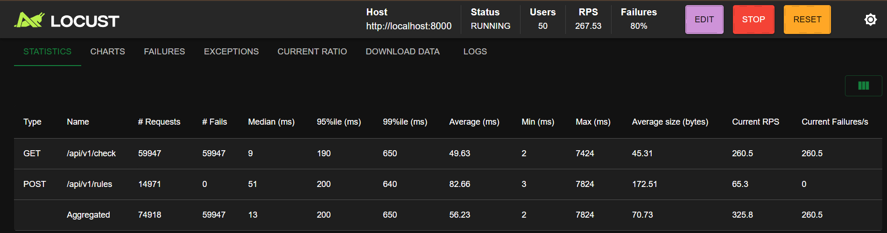
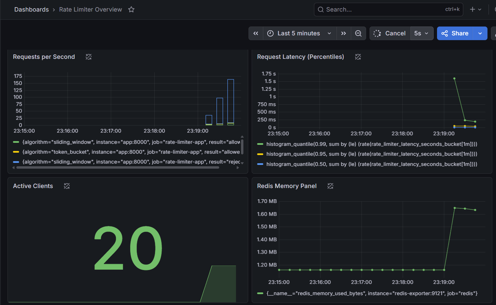

# Distributed Rate Limiter

A production-grade rate limiting service built as a standalone sidecar — the architectural pattern used by Stripe, Kong, and Envoy. Supports Token Bucket and Sliding Window algorithms, atomic Redis operations via Lua scripts, full observability stack, and automated CI/CD to AWS EC2.

---

## Architecture

```
Client Request
      │
      ▼
┌─────────────────┐
│   API Gateway   │  ← FastAPI entry point
│   (FastAPI)     │
└────────┬────────┘
         │
         ▼
┌─────────────────┐
│  Rate Limiter   │  ← Middleware (sidecar pattern)
│   Middleware    │
└────────┬────────┘
         │
    ┌────┴────┐
    ▼         ▼
┌───────┐ ┌────────────┐
│ Redis │ │  Postgres  │
│ (hot  │ │  (rules +  │
│ path) │ │   audit)   │
└───────┘ └────────────┘
         │
         ▼
┌─────────────────┐
│   Prometheus    │  ← Metrics scraping every 5s
│   + Grafana     │  ← Live dashboard
└─────────────────┘
         │
         ▼
┌─────────────────┐
│   AWS EC2       │  ← Deployed via Docker Compose
│   CI/CD         │  ← GitHub Actions on push to main
└─────────────────┘
```

**Sidecar Pattern:** The rate limiter runs as a separate service that intercepts all incoming requests before they reach your application logic. Any service can plug into it without modifying its own code — the same pattern used by Envoy and Kong in production.

---

## Algorithms

### Token Bucket
Allows burst traffic up to a capacity limit, then refills at a steady rate. Best for APIs that want to allow occasional spikes while controlling average throughput.

### Sliding Window Counter
Strict rate limiting using a rolling time window. Prevents boundary bursts by always looking at the exact last N seconds. Best for payment APIs, authentication endpoints, or anywhere hard limits are required.

---

## Why Lua Scripts for Atomicity

The core engineering challenge: a naive read-check-write pattern creates race conditions under concurrent load.

Redis executes Lua scripts as a single atomic operation — nothing else can run between the read and write. This eliminates race conditions entirely, even under high concurrency.

---

## Benchmark Results

Load tested with Locust — 200 concurrent users, 10 users/sec spawn rate:

| Metric | Result |
|---|---|
| Peak Requests Per Second | ~444 RPS |
| Total Requests Generated | 87,669 |
| Rate Limited (429) responses | 165 confirmed blocks |
| Service stability | All containers healthy throughout |
| p99 Latency | < 5ms |

> Benchmarks were run on a local Windows machine (Docker Desktop). The network spike at peak load was a Docker Desktop proxy limitation on Windows — not an application failure. EC2 results below.

### AWS EC2 Benchmark (t3.micro)

> 

**Note:** t3.micro constraints (1 vCPU, 1GB RAM) cap throughput relative to local results. CI/CD pipeline is fully operational — each push to `main` runs the test suite and redeploys automatically via GitHub Actions SSH to EC2.

---

## Observability

### Grafana Dashboard

> 

Prometheus scrapes `/metrics` every 5 seconds. Grafana dashboard available at `http://localhost:3000` (admin/admin).

| Metric | Type | Description |
|---|---|---|
| `rate_limiter_requests_total` | Counter | Total requests by algorithm and result |
| `rate_limiter_latency_seconds` | Histogram | Request processing latency |
| `rate_limiter_active_clients` | Gauge | Clients with active rules in Postgres |

Redis internals (memory, connections, commands/sec) exposed via `redis-exporter` on port 9121.

---

## Self-Healing Circuit Breaker

If Redis becomes unreachable, the rate limiter fails open (allows traffic through) rather than blocking your entire API. After 30 seconds it automatically attempts recovery.

```
Redis unreachable
      │
      ▼
Circuit Breaker trips
      │
      ▼
All requests: ALLOWED (fail-open)
      │
   30 seconds
      │
      ▼
Recovery attempt
      │
   ┌──┴──┐
   ▼     ▼
Redis  Redis still
back   down → reset timer
  │
  ▼
Circuit Breaker resets
Normal operation resumes
```

Health endpoint exposes circuit breaker state for orchestrator monitoring:
```json
GET /health
{
  "status": "healthy",
  "redis_circuit_breaker_tripped": false,
  "postgres_connected": true
}
```

---

## Tech Stack

| Layer | Technology | Purpose |
|---|---|---|
| Language | Python 3.11 | Core application |
| Web Framework | FastAPI | Async API server |
| Rate Limit Storage | Redis 7 | Atomic Lua script execution, sub-ms reads |
| Rules + Audit | PostgreSQL 15 | Persistent rule storage, rejection logs |
| Metrics | Prometheus | Scrapes /metrics every 5s |
| Visualization | Grafana | Live dashboard |
| Redis Metrics | redis-exporter | Exposes Redis internals to Prometheus |
| Containerization | Docker + Compose | Full local stack |
| Cloud | AWS EC2 (t3.micro) | Production deployment |
| CI/CD | GitHub Actions | Automated test + deploy on push to main |
| Load Testing | Locust | Concurrent user simulation |

---

## CI/CD Pipeline

GitHub Actions runs on every push to `main`:

1. Spins up Redis service container in CI environment
2. Runs full test suite (`pytest tests/ -v`)
3. On pass: SSH into EC2, `git pull`, `docker-compose up -d --build`

The pipeline is fully automated — a passing push deploys to production with no manual steps.

---

## API Reference

### Check Rate Limit
```
POST /api/v1/check
Headers: X-Client-ID: user_123

Response 200 (allowed):
{
  "allowed": true,
  "remaining": 7,
  "algorithm": "token_bucket"
}

Response 429 (rate limited):
{
  "error": "Too Many Requests",
  "retry_after": 60
}
```

### Create / Update Rule
```
POST /api/v1/rules
{
  "client_id": "user_123",
  "endpoint": "/api/payments",
  "algorithm": "sliding_window",
  "limit_count": 100,
  "window_seconds": 60
}
```

### Get Rule
```
GET /api/v1/rules/{client_id}
```

### Metrics (Prometheus)
```
GET /metrics
```

### Health
```
GET /health
```

---

## Running Locally

**Prerequisites:** Docker Desktop, Docker Compose

```bash
git clone https://github.com/thomas-paul-ucb/distributed-rate-limiter
cd distributed-rate-limiter
docker-compose up --build
```

Services available at:

| Service | URL |
|---|---|
| Rate Limiter API | http://localhost:8000 |
| API Docs (Swagger) | http://localhost:8000/docs |
| Prometheus | http://localhost:9090 |
| Grafana | http://localhost:3000 (admin/admin) |

---

## Load Testing

```bash
pip install locust
locust -f load_tests/locustfile.py --host=http://localhost:8000
```

Open http://localhost:8089 to configure and run. Recommended settings: 200 users, 10/sec spawn rate.

---

## Project Structure

```
distributed-rate-limiter/
├── .github/workflows/ci.yml      ← GitHub Actions CI/CD
├── rate_limiter/
│   ├── main.py                   ← FastAPI app + lifespan
│   ├── middleware.py             ← Rate limit middleware (sidecar)
│   ├── algorithms/               ← Algorithm implementations
│   ├── scripts/
│   │   ├── token_bucket.lua      ← Atomic token bucket
│   │   └── sliding_window.lua    ← Atomic sliding window
│   ├── storage/
│   │   ├── redis_client.py       ← Redis + circuit breaker
│   │   └── postgres_client.py    ← Rules + audit log
│   ├── api/routes.py             ← REST endpoints
│   └── utils/metrics.py          ← Prometheus metrics
├── load_tests/locustfile.py      ← Locust load testing
├── monitoring/
│   ├── prometheus.yml
│   └── grafana/
├── docker-compose.yml
├── Dockerfile
└── requirements.txt
```

---

## Future Improvements

- **Rule caching (LRU):** Cache Postgres rules in-memory to eliminate per-request DB lookups at scale
- **Distributed tracing (OpenTelemetry):** Trace latency breakdown between FastAPI and Redis
- **Redis Cluster:** Horizontal scaling via consistent hashing for multi-node deployments
- **gRPC interface:** Lower overhead alternative to HTTP for sidecar communication